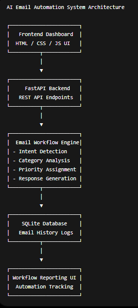
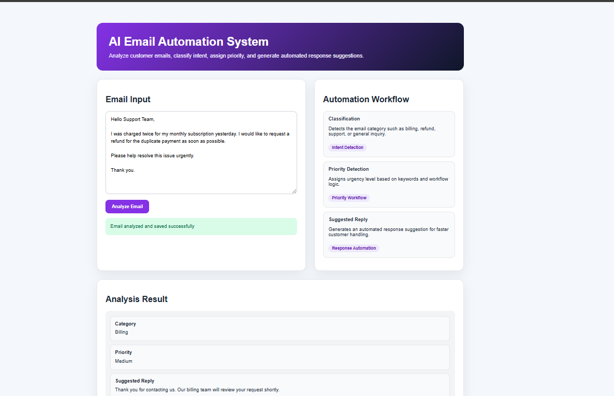
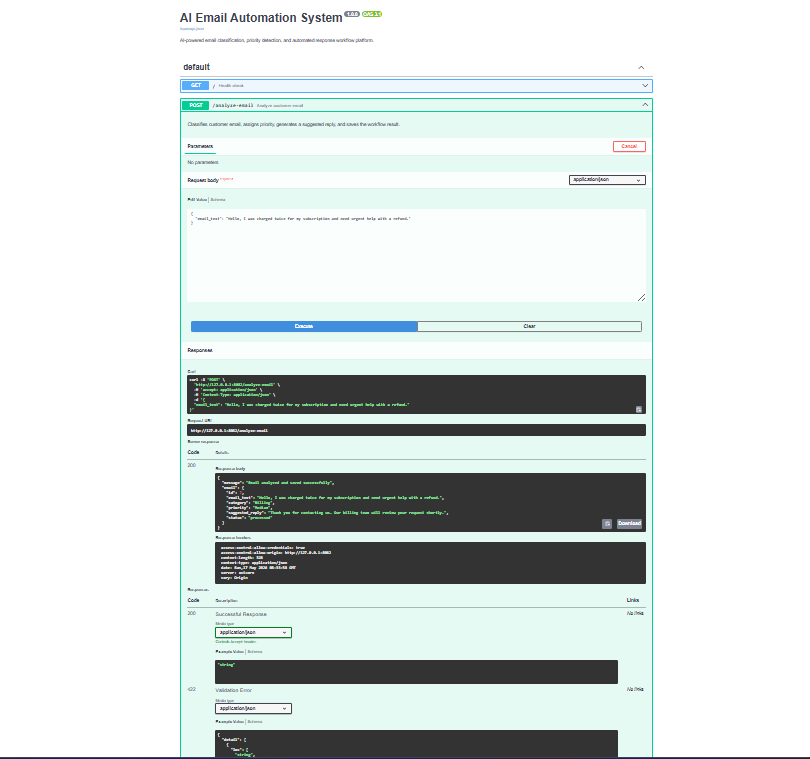
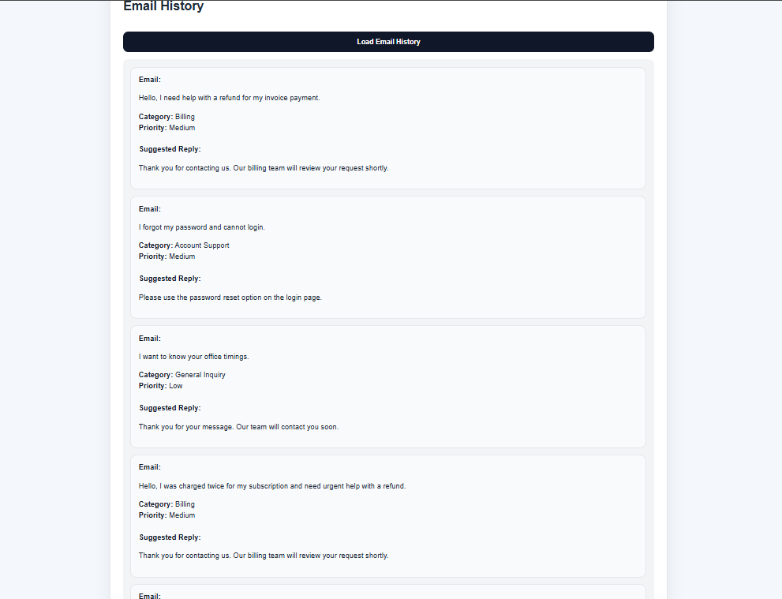

# AI Email Automation System


## Overview

AI Email Automation System is an AI-powered operational workflow platform designed to automate customer email analysis, categorization, priority assignment, and automated response generation.

The system demonstrates practical implementation of workflow automation for customer operations and support management using FastAPI, SQLite, and frontend dashboard workflows.

## Problem Statement

Organizations receive large volumes of customer emails daily, including:

- refund requests
- billing complaints
- urgent support issues
- payment failures
- authentication problems

Manual handling of repetitive customer communication creates operational delays and increases support overhead.

## Solution

This platform automates customer email workflows by:

- analyzing customer email content
- detecting operational intent
- assigning workflow priority
- generating automated responses
- storing workflow history
- enabling operational tracking

## Key Features

- AI-style email analysis
- Intent detection workflows
- Email categorization
- Priority assignment
- Automated response generation
- Email workflow history
- FastAPI backend APIs
- Interactive frontend dashboard
- Swagger API documentation
- SQLite database integration
- Operational workflow simulation

## Technologies Used

- Python
- FastAPI
- SQLAlchemy
- SQLite
- HTML
- CSS
- JavaScript
- REST APIs
- Uvicorn

## System Workflow

1. User submits customer email
2. Backend analyzes email content
3. Workflow engine detects intent
4. Email category assigned
5. Priority level calculated
6. Automated reply generated
7. Email workflow stored in database
8. Operational history becomes available for review

## Architecture Diagram



```text
Frontend Dashboard
        ↓
FastAPI Backend
        ↓
Email Workflow Engine
        ↓
SQLite Database
        ↓
Workflow Reporting UI
```

## API Endpoints

| Method | Endpoint | Description |
|---|---|---|
| GET | `/` | Health check |
| POST | `/analyze-email` | Analyze customer email |
| GET | `/emails` | Load analyzed emails |

## Example Request

```json
{
  "email_text": "Hello, I was charged twice for my subscription and need urgent help with a refund."
}
```

## Example Response

```json
{
  "message": "Email analyzed and saved successfully",
  "email": {
    "id": 1,
    "category": "Billing",
    "priority": "High",
    "suggested_reply": "We are reviewing your payment issue and will assist shortly.",
    "status": "processed"
  }
}
```

## Screenshots

### Dashboard



### API Documentation



### Email History



## Demo Video

[Watch Demo Video](demo/ai-email-automation-demo.mp4)

## Installation

Clone repository:

```bash
git clone https://github.com/NASRATULLAH786/ai-email-automation-system.git
cd ai-email-automation-system
```

Create virtual environment:

```bash
python -m venv venv
```

Activate virtual environment:

```bash
venv\Scripts\activate
```

Install dependencies:

```bash
pip install -r requirements.txt
```

Run backend:

```bash
uvicorn app.main:app --reload --port 8082
```

Open API documentation:

```text
http://127.0.0.1:8082/docs
```

Open frontend:

```text
frontend/index.html
```

## Environment Variables

Create local `.env` file:

```env
GROQ_API_KEY=
DATABASE_URL=sqlite:///./emails.db
MODEL_NAME=llama3-70b-8192
APP_ENV=development
```

## Technical Challenges

- Email intent classification
- Workflow response generation
- Priority assignment logic
- Frontend/backend synchronization
- Operational workflow tracking
- Database persistence
- Error handling

## Future Improvements

- Real LLM integration
- Gmail API integration
- Multi-user support
- Authentication system
- Workflow analytics dashboard
- Email sentiment analysis
- Cloud deployment
- Notification systems

## Project Impact

This project demonstrates practical AI automation engineering skills including:

- backend API development
- workflow automation
- operational system design
- frontend/backend integration
- database-driven workflows
- AI-style email processing systems